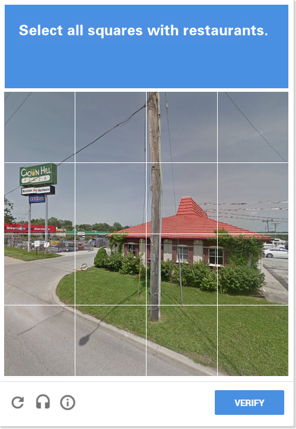
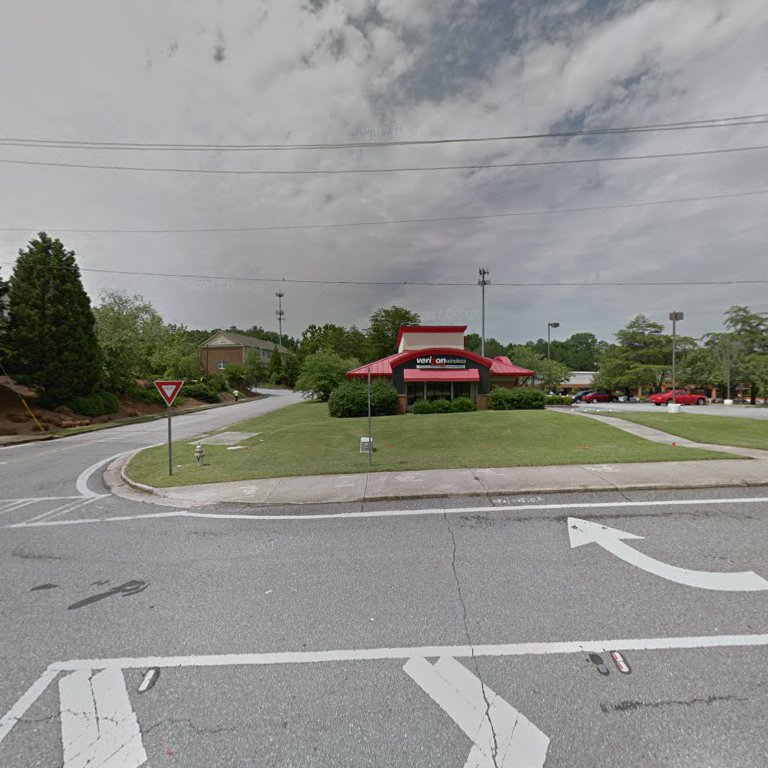
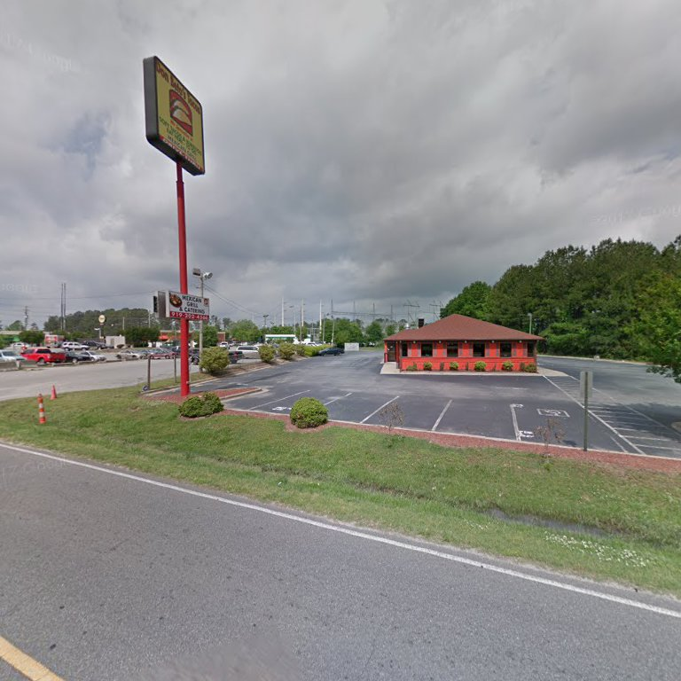

<p align="center">
  
</p>

<h3 align="center">A data science exercise to programmatically find buildings that *used* to be Pizza Hut restaraunts...</h3>

<h2 align="center">My main inspiration for this project: https://www.reddit.com/r/FormerPizzaHuts/</h2>

## Finding Store Status

Pizza Hut has an API that returns store information by Store Number.  Fortunately, this API has no real form of rate limitation, so I iterated through all possible store combinations.

To return store information you simply send a POST request with form data that contains a storeNum parameter to the following API endpoint:

<b>https://www.pizzahut.com/api.php/site/api_ajax/stores/getStoreAjax</b>

You will get a response that looks similar to this:

```javascript
{
    "success": 1,
    "response": {
        "storeNum": "027543",
        "address1": "8024 Augusta Rd",
        "address2": "Piedmont, SC 29673",
        "zip": "29673",
        "phone": "(864) 277-1222",
        "landmark": "",
        "hrs_available": 1,
        "hrs_concepts": [{
            "service": "carryout"
        }, {
            "service": "delivery"
        }],
        "hrs_times": [{
            "day": "Sun",
            "col0": "11:00am - 11:00pm",
            "col1": "11:00am - 11:00pm"
        }, {
            "day": "Mon",
            "col0": "11:00am - 11:00pm",
            "col1": "11:00am - 11:00pm"
        }, {
            "day": "Tues",
            "col0": "11:00am - 11:00pm",
            "col1": "11:00am - 11:00pm"
        }, {
            "day": "Weds",
            "col0": "11:00am - 11:00pm",
            "col1": "11:00am - 11:00pm"
        }, {
            "day": "Thurs",
            "col0": "11:00am - 11:00pm",
            "col1": "11:00am - 11:00pm"
        }, {
            "day": "Fri",
            "col0": "11:00am - 12:00am",
            "col1": "11:00am - 12:00am"
        }, {
            "day": "Sat",
            "col0": "11:00am - 12:00am",
            "col1": "11:00am - 12:00am"
        }],
        "dinein_available": 0,
        "services": "Carryout, Delivery",
        "wing_street": 1,
        "latitude": 34.696159,
        "longitude": -82.398854,
        "closure_reason": "",
        "carryout_future_order": true,
        "delivery_future_order": true,
        "city": "Piedmont",
        "offline": false,
        "status": "open",
        "occasion_status": "DC",
        "store_status": "DC",
        "delivery_available": true,
        "offline_status_msg": "",
        "first_delivery": "11:00 AM",
        "first_carryout": "11:00 AM",
        "open_later_today_delivery": "",
        "open_later_today_carryout": "",
        "loyalty": {
            "address": "8024 Augusta Rd",
            "city": "Piedmont",
            "state": "SC",
            "state_name": "South Carolina",
            "zip": 29673,
            "phone": "(864) 277-1222",
            "status": "DC",
            "carryout_open": "11:00AM",
            "carryout_close": "11:00PM",
            "carryout_future_order": true,
            "delivery_open": "11:00AM",
            "delivery_close": "11:00PM",
            "delivery_future_order": true,
            "open_for_delivery": true,
            "closure_reason": "",
            "onlineStatus": "online",
            "firstTimeDiscount": false,
            "currentlyOpen": true,
            "deliveryAvailable": true,
            "carryoutAvailable": true,
            "acceptFutureOrders": true,
            "landmark": null,
            "futuredelivery": true,
            "futurecarryout": true,
            "pizzaEvoTestStore": true,
            "offlineStatusMsg": null,
            "loyalty": "Y",
            "tmp_offline_msg": "",
            "store_lastUpdate": null,
            "showDeliveryTime": "Y",
            "promiseTimeDel": 50,
            "promiseTimeLastUpdateDel": {
                "date": "2018-06-24 16:27:00.000000",
                "timezone_type": 3,
                "timezone": "US\/Central"
            },
            "showCarryoutTime": "Y",
            "promiseTimeCo": 15,
            "promiseTimeLastUpdateCo": {
                "date": "2018-06-24 16:25:00.000000",
                "timezone_type": 3,
                "timezone": "US\/Central"
            },
            "promiseTime": 50
        }
    }
}
```

Here is the Python function used to determine if the store was Open, Closed, or Non-Existant (Note that this simply prints out the results, however the actual code used in main.py will save store information to a local file.)

```python
def checkStore(storeNums):
	data = '{"storeNum":"NUM"}'.replace("NUM", str(storeNum))
	response = requests.post('https://www.pizzahut.com/api.php/site/api_ajax/stores/getStoreAjax', data=data)
	if response.json()['response']['phone'] == None:
		print("Not a Real Store")
	elif response.json()['response']['longitude'] == 0:
		print("Closed Store")
	else:
		print("Open Store")
```


## Grabbing Images

After finding restaraunt addresses that have recently closed, the program uses Google Maps to extract photos from the location.  It does this by making a Google search for the address to extract the *Panoid* value from the first Google Maps URL in the search results.  The Panoid is then used to directly pull images using the following API endpoint:

http://geo1.ggpht.com/cbk?panoid={panoid}&output=thumbnail&cb_client=search.LOCAL_UNIVERSAL.gps&thumb=2&w=2000&h=2000&yaw={cameraTilt}&pitch=0&thumbfov=100

After pulling the panoid it will extract 17 images from each address using camera orientation values ranging from 0 to 340.  Additionally, camera orientation values are "randomized" by adding a random float between 0 and 1 to the orientaiton.  This does not significantly affect the camera orientation, but it prevents bot detection when accessing this API endpoint frequently.


```python
def grabImagesFromAddress(address):
	imageList = []
	# Contains a list of image URLs
	addressURL = address.replace(" ", "+")
	# Converts address to a valid URL address
	url = "https://www.google.com/maps/place/" + addressURL
	# Gens URL for this address
	res = grabSite(url)
	# Pulls the url that was previously defined
	page = bs4.BeautifulSoup(res.text, 'lxml')
	# Converts it into a BS4 Object
	panoidVal = grabPanoidFromHTML(page)
	# This grabs the Panoid val from that address
	if panoidVal != None:
		# This means the address did exist
		for cameraOrientationVal in genListOfCameraOrientations():
			# Iterates through all possible camera orientations
			imageList.append(GOOGLE_STREETVIEW_API.format(panoidVal, cameraOrientationVal))
			# Appends them to the list of images
		return imageList
```


## Ensuring Accuracy

The most time intensive part of this project was identifying the best *camera orientation* for each set of location images.  The program pulls **17** camera orientations for each address, and the pizza hut is usually in only 1 or 2 of these images.


### Method #1

The most cost effective way of finding the ideal camera orientation was using an unrelated service called **DeathByCapthca**.  DBC uses real people to solve Captcha images, but the service is *usually* used by spammers and bot creators.  I theorized that if I turned my Pizza Hut images into Captchas, DBC would send back the image coordinates of the Pizza Hut locations.

Here is an example of the generated Captcha image:

<p align="center">
  
</p>

Captcha images were then sent to DeathByCaptcha, and the *quantity* of solved coordinates were used to find the best image of each restaraunt.

Here is an example using psuedocode:

```python
# This is pseudocode, but the captcha.py file contains the actual python code
listOfImages = GrabImages("123 Test Street, Palo Alto CA")
# Grabs the Pizza Hut images at 123 Test Street, Palo Alto CA...
listOfImageInfo = []
for image in listOfImages:
    # Iterates through all 17 camera orientations
    fakeCaptcha = generateCaptcha(image)
    # Generates a "Fake" captcha image
    coordinates = SolveCaptcha(fakeCaptcha)
    # DBC returns coordinates of the squares that contain restaraunts
    listOfImageInfo({"image_file": image, "number_of_restaraunts": len(coordinates)})
    # Creates a dictionary with image file and the number of squares containing restaraunts
mostRestaraunts = 0
for imageInfo in listOfImageInfo:
    if imageInfo['number_of_restaraunts'] > mostRestaraunts:
        bestImage = imageInfo['image_file']
return bestImage
```

### Method #2

The captcha method worked for *most* images, but there was still a handful of photos that either didn't contain a Pizza Hut or that contained photos of *other buildings* in the image.  To resolve this issue, I created a python script that iterates through all remaining addresses, and opens up a window that allows you to move through images quickly to pick the image that best displays the *former* Pizza Hut location.  This also allowed me to eliminate Pizza Hut locations that had been torn down and replaced with building that didn't keep the iconic Pizza Hut building style...

```python
cameraTilt = list(range(0, 340, 20))
# This contains all camera tilt orientations in the Google Car
currentOrientation = cameraTilt[0]
while True:
	fileName = genFileName(address, currentOrientation)
	# Filename for this specific camera orientation
	keyChoice = viewImage(fileName)
	# Keychoice is the key a user presses in the image window
	if keyChoice == ord('n'):
		# The user inputted the letter N
		newTilt = cameraTilt.index(currentOrientation) + 1
		if newTilt == len(cameraTilt):
			# This is going to refresh the orientation from 320+ to 0
			# ^ This allows for a smoothless transition between images
			newTilt = 0
		currentOrientation = cameraTilt[newTilt]
		# Sets new orientation
	if keyChoice == ord("p"):
		# The user inputted the letter P
		currentOrientation = cameraTilt[cameraTilt.index(currentOrientation) - 1]
		# Sets new orientation
	if keyChoice == ord("q"):
		# The user inputted the letter Q
		# This indicates that this image did not have a Pizza hut
		break
		# Quits the while loop
	if keyChoice == ord("s"):
		# The user inputted the letter S
		# This indicates the user wants to save on the current image
		saveImage(fileName)
		# Saves the image
		break
		# Quits the while loop
	print("{} IN LOOP {}".format(currentOrientation, fileName))
	# Prints out information about the image
```


## Examples

<p align="center"><i>
  

<h3 align="center">Verizon Wireless - 8514 Holcomb Bridge Rd, Alpharetta GA 20022</h3>
</i></p>
<p align="center"><i>
  

<h3 align="center">Moe's Cafe - 4705 River Oaks Blvd, Fort Worth TX 76114</h3>
</i></p>
<p align="center"><i>
  

<h3 align="center">Don Beto's Tacos - 720 Ricks Rd, Selma NC</h3>
</i></p>
<p align="center"><i>
  

<h3 align="center">Carlos Mexican Grill #3 - 282 W Virginia St. Crystal Lake IL 60014</h3>
</i></p>
<p align="center"><i>
  

<h3 align="center">Sakura Japanese Restaraunt - Carlos Mexican Grill #3 - 201 Inman Rd, Lyman SC 29365</h3>
</i></p>

# Locations Found

<a href="PizzaHuts/1940_Main_St,_Green_Bay,WI.jpg">1940 Main St, Green Bay,WI</a><br>
<a href="PizzaHuts/2309_Lafayette_Rd,_Fort_Oglethorpe,GA.jpg">2309 Lafayette Rd, Fort Oglethorpe,GA</a><br>
<a href="PizzaHuts/3278_Lancaster_Dr_Ne,_Salem,OR.jpg">3278 Lancaster Dr Ne, Salem,OR</a><br>
<a href="PizzaHuts/6049_Memorial_Dr,_Stone_Mountain,GA.jpg">6049 Memorial Dr, Stone Mountain,GA</a><br>
<a href="PizzaHuts/220_Cumberland_St,_Bogalusa,LA.jpg">220 Cumberland St, Bogalusa,LA</a><br>
<a href="PizzaHuts/440_East_St,_Pittsboro,NC.jpg">440 East St, Pittsboro,NC</a><br>
<a href="PizzaHuts/1123_Highway_301_N,_Dillon,SC.jpg">1123 Highway 301 N, Dillon,SC</a><br>
<a href="PizzaHuts/124_Water_St,_Newton,NJ.jpg">124 Water St, Newton,NJ</a><br>
<a href="PizzaHuts/1215_S_Gordon_St,_Alvin,TX.jpg">1215 S Gordon St, Alvin,TX</a><br>
<a href="PizzaHuts/7114_Mechanicsville_Tpke,_Mechanicsville,VA.jpg">7114 Mechanicsville Tpke, Mechanicsville,VA</a><br>
<a href="PizzaHuts/147_Mansfield_Ave,_Shelby,OH.jpg">147 Mansfield Ave, Shelby,OH</a><br>
<a href="PizzaHuts/6304_Leesburg_Pike,_Falls_Church,VA.jpg">6304 Leesburg Pike, Falls Church,VA</a><br>
<a href="PizzaHuts/3322_W_Loomis_Rd,_Milwaukee,WI.jpg">3322 W Loomis Rd, Milwaukee,WI</a><br>
<a href="PizzaHuts/3586_Homestead_Rd,_Santa_Clara,CA.jpg">3586 Homestead Rd, Santa Clara,CA</a><br>
<a href="PizzaHuts/6710_S_Broadway_Ave,_Tyler,TX.jpg">6710 S Broadway Ave, Tyler,TX</a><br>
<a href="PizzaHuts/1001_E_Loop_304,_Crockett,TX.jpg">1001 E Loop 304, Crockett,TX</a><br>
<a href="PizzaHuts/2684_Shaffer_Rd,_Atwater,CA.jpg">2684 Shaffer Rd, Atwater,CA</a><br>
<a href="PizzaHuts/3810_Oakwood_Blvd,_Melvindale,MI.jpg">3810 Oakwood Blvd, Melvindale,MI</a><br>
<a href="PizzaHuts/145_Clarice_Dr,_Holly_Springs,MS.jpg">145 Clarice Dr, Holly Springs,MS</a><br>
<a href="PizzaHuts/65_Lakeview_Dr,_Clinton,MS.jpg">65 Lakeview Dr, Clinton,MS</a><br>
<a href="PizzaHuts/2749_S_Main_St,_High_Point,NC.jpg">2749 S Main St, High Point,NC</a><br>
<a href="PizzaHuts/1367_Progressive_Ave,_Seward,NE.jpg">1367 Progressive Ave, Seward,NE</a><br>
<a href="PizzaHuts/5214_Dixie_Hwy,_Waterford_Twp,MI.jpg">5214 Dixie Hwy, Waterford Twp,MI</a><br>
<a href="PizzaHuts/2423_N_Herritage_St,_Kinston,NC.jpg">2423 N Herritage St, Kinston,NC</a><br>
<a href="PizzaHuts/11975_Bernardo_Plaza_Dr,_San_Diego,CA.jpg">11975 Bernardo Plaza Dr, San Diego,CA</a><br>
<a href="PizzaHuts/6102_Falls_Of_Neuse_Rd,_Raleigh,NC.jpg">6102 Falls Of Neuse Rd, Raleigh,NC</a><br>
<a href="PizzaHuts/5900_S_Western_Ave,_Chicago,IL.jpg">5900 S Western Ave, Chicago,IL</a><br>
<a href="PizzaHuts/208_Mcguinness_Blvd,_Brooklyn,NY.jpg">208 Mcguinness Blvd, Brooklyn,NY</a><br>
<a href="PizzaHuts/1908_W_Main_St,_Kalamazoo,MI.jpg">1908 W Main St, Kalamazoo,MI</a><br>
<a href="PizzaHuts/14563_60th_St_N,_Stillwater,MN.jpg">14563 60th St N, Stillwater,MN</a><br>
<a href="PizzaHuts/839_E_2nd_St,_Chase_City,VA.jpg">839 E 2nd St, Chase City,VA</a><br>
<a href="PizzaHuts/6285_W_Park_Ave,_Houma,LA.jpg">6285 W Park Ave, Houma,LA</a><br>
<a href="PizzaHuts/2917_Fort_Campbell_Blvd,_Hopkinsville,KY.jpg">2917 Fort Campbell Blvd, Hopkinsville,KY</a><br>
<a href="PizzaHuts/2661_Main_St_West_Sw,_Snellville,GA.jpg">2661 Main St West Sw, Snellville,GA</a><br>
<a href="PizzaHuts/3854_Central_Ave_Ne,_Minneapolis,MN.jpg">3854 Central Ave Ne, Minneapolis,MN</a><br>
<a href="PizzaHuts/11420_E_Washington_St,_Indianapolis,IN.jpg">11420 E Washington St, Indianapolis,IN</a><br>
<a href="PizzaHuts/1076_Harkrider_St,_Conway,AR.jpg">1076 Harkrider St, Conway,AR</a><br>
<a href="PizzaHuts/7000_W_Charleston_Blvd,_Las_Vegas,NV.jpg">7000 W Charleston Blvd, Las Vegas,NV</a><br>
<a href="PizzaHuts/3779_S_Cooper_St,_Arlington,TX.jpg">3779 S Cooper St, Arlington,TX</a><br>
<a href="PizzaHuts/475_E_Us_69,_Kansas_City,MO.jpg">475 E Us 69, Kansas City,MO</a><br>
<a href="PizzaHuts/346_N_University_Ave,_Provo,UT.jpg">346 N University Ave, Provo,UT</a><br>
<a href="PizzaHuts/907_S_High_St,_West_Chester,PA.jpg">907 S High St, West Chester,PA</a><br>
<a href="PizzaHuts/7685_E_Colonial_Dr,_Orlando,FL.jpg">7685 E Colonial Dr, Orlando,FL</a><br>
<a href="PizzaHuts/257_Plainfield_Rd,_West_Lebanon,NH.jpg">257 Plainfield Rd, West Lebanon,NH</a><br>
<a href="PizzaHuts/6223_Crain_Hwy,_La_Plata,MD.jpg">6223 Crain Hwy, La Plata,MD</a><br>
<a href="PizzaHuts/2202_N_Galloway_Ave,_Mesquite,TX.jpg">2202 N Galloway Ave, Mesquite,TX</a><br>
<a href="PizzaHuts/4610_Capital_Blvd,_Raleigh,NC.jpg">4610 Capital Blvd, Raleigh,NC</a><br>
<a href="PizzaHuts/2101_Plum_Grove_Rd,_Rolling_Meadows,IL.jpg">2101 Plum Grove Rd, Rolling Meadows,IL</a><br>
<a href="PizzaHuts/1026_N_Duquesne_Blvd,_Duquesne,PA.jpg">1026 N Duquesne Blvd, Duquesne,PA</a><br>
<a href="PizzaHuts/211_Nw_Barry_Rd,_Kansas_City,MO.jpg">211 Nw Barry Rd, Kansas City,MO</a><br>
<a href="PizzaHuts/3694_Mercer_University_Dr,_Macon,GA.jpg">3694 Mercer University Dr, Macon,GA</a><br>
<a href="PizzaHuts/3505_Gravois_Ave,_St_Louis,MO.jpg">3505 Gravois Ave, St Louis,MO</a><br>
<a href="PizzaHuts/226_9th_Ave_Se,_Mayville,ND.jpg">226 9th Ave Se, Mayville,ND</a><br>
<a href="PizzaHuts/1739_Pearl_Rd,_Brunswick,OH.jpg">1739 Pearl Rd, Brunswick,OH</a><br>
<a href="PizzaHuts/611_N_Oceanshore_Blvd,_Flagler_Beach,FL.jpg">611 N Oceanshore Blvd, Flagler Beach,FL</a><br>
<a href="PizzaHuts/1325_Town_Centre_Dr,_St_Paul,MN.jpg">1325 Town Centre Dr, St Paul,MN</a><br>
<a href="PizzaHuts/46_Crystal_Ave,_Derry,NH.jpg">46 Crystal Ave, Derry,NH</a><br>
<a href="PizzaHuts/1428_W_Galena_Ave,_Freeport,IL.jpg">1428 W Galena Ave, Freeport,IL</a><br>
<a href="PizzaHuts/15380_George_O_Neal_Rd,_Baton_Rouge,LA.jpg">15380 George O Neal Rd, Baton Rouge,LA</a><br>
<a href="PizzaHuts/3884_Hixson_Pike,_Chattanooga,TN.jpg">3884 Hixson Pike, Chattanooga,TN</a><br>
<a href="PizzaHuts/1227_N_24th_St,_Quincy,IL.jpg">1227 N 24th St, Quincy,IL</a><br>
<a href="PizzaHuts/3800_Williams_Blvd,_Kenner,LA.jpg">3800 Williams Blvd, Kenner,LA</a><br>
<a href="PizzaHuts/4236_Peach_St,_Erie,PA.jpg">4236 Peach St, Erie,PA</a><br>
<a href="PizzaHuts/1927_N_Highway_65,_Lake_Village,AR.jpg">1927 N Highway 65, Lake Village,AR</a><br>
<a href="PizzaHuts/1772_Fremont_Blvd,_Seaside,CA.jpg">1772 Fremont Blvd, Seaside,CA</a><br>
<a href="PizzaHuts/1811_Cleveland_Rd,_Sandusky,OH.jpg">1811 Cleveland Rd, Sandusky,OH</a><br>
<a href="PizzaHuts/7897_Normandy_Blvd,_Jacksonville,FL.jpg">7897 Normandy Blvd, Jacksonville,FL</a><br>
<a href="PizzaHuts/601_1st_Ave_Se,_Moultrie,GA.jpg">601 1st Ave Se, Moultrie,GA</a><br>
<a href="PizzaHuts/29_Warren_St,_Randolph,MA.jpg">29 Warren St, Randolph,MA</a><br>
<a href="PizzaHuts/1244_S_Range_Ave,_Denham_Springs,LA.jpg">1244 S Range Ave, Denham Springs,LA</a><br>
<a href="PizzaHuts/720_N_State_Road_25,_Rochester,IN.jpg">720 N State Road 25, Rochester,IN</a><br>
<a href="PizzaHuts/10595_Greenbelt_Rd,_Lanham,MD.jpg">10595 Greenbelt Rd, Lanham,MD</a><br>
<a href="PizzaHuts/2633_Williams_Blvd,_Kenner,LA.jpg">2633 Williams Blvd, Kenner,LA</a><br>
<a href="PizzaHuts/500_Sw_10th_Ave,_Topeka,KS.jpg">500 Sw 10th Ave, Topeka,KS</a><br>
<a href="PizzaHuts/6303_N_Meridian_Ave,_Oklahoma_City,OK.jpg">6303 N Meridian Ave, Oklahoma City,OK</a><br>
<a href="PizzaHuts/831_W_6th_Ave,_Emporia,KS.jpg">831 W 6th Ave, Emporia,KS</a><br>
<a href="PizzaHuts/1300_S_Noland_Rd,_Independence,MO.jpg">1300 S Noland Rd, Independence,MO</a><br>
<a href="PizzaHuts/218_Andover_St,_Peabody,MA.jpg">218 Andover St, Peabody,MA</a><br>
<a href="PizzaHuts/13886_Old_Columbia_Pike,_Silver_Spring,MD.jpg">13886 Old Columbia Pike, Silver Spring,MD</a><br>
<a href="PizzaHuts/308_N_Boulder_Hwy,_Henderson,NV.jpg">308 N Boulder Hwy, Henderson,NV</a><br>
<a href="PizzaHuts/8_Traders_Way,_Salem,MA.jpg">8 Traders Way, Salem,MA</a><br>
<a href="PizzaHuts/3455_Ross_Clark_Cir,_Dothan,AL.jpg">3455 Ross Clark Cir, Dothan,AL</a><br>
<a href="PizzaHuts/6946_Fm_1960_Rd_E,_Humble,TX.jpg">6946 Fm 1960 Rd E, Humble,TX</a><br>
<a href="PizzaHuts/1023_W_Main_St,_Princeton,KY.jpg">1023 W Main St, Princeton,KY</a><br>
<a href="PizzaHuts/908_S_Kniss_Ave,_Luverne,MN.jpg">908 S Kniss Ave, Luverne,MN</a><br>
<a href="PizzaHuts/1924_S_Minnesota_Ave,_Sioux_Falls,SD.jpg">1924 S Minnesota Ave, Sioux Falls,SD</a><br>
<a href="PizzaHuts/1501_N_Palm_Canyon_Dr,_Palm_Springs,CA.jpg">1501 N Palm Canyon Dr, Palm Springs,CA</a><br>
<a href="PizzaHuts/1600_Independence_Pky,_Plano,TX.jpg">1600 Independence Pky, Plano,TX</a><br>
<a href="PizzaHuts/5025_Lapalco_Blvd,_Marrero,LA.jpg">5025 Lapalco Blvd, Marrero,LA</a><br>
<a href="PizzaHuts/445_Center_St,_Auburn,ME.jpg">445 Center St, Auburn,ME</a><br>
<a href="PizzaHuts/791_Lisbon_St,_Lewiston,ME.jpg">791 Lisbon St, Lewiston,ME</a><br>
<a href="PizzaHuts/3150_Jefferson_St,_Napa,CA.jpg">3150 Jefferson St, Napa,CA</a><br>
<a href="PizzaHuts/921_E_Danforth_Rd,_Edmond,OK.jpg">921 E Danforth Rd, Edmond,OK</a><br>
<a href="PizzaHuts/745_W_Cypress_St,_Kennett_Square,PA.jpg">745 W Cypress St, Kennett Square,PA</a><br>
<a href="PizzaHuts/2200_National_Rd_W,_Richmond,IN.jpg">2200 National Rd W, Richmond,IN</a><br>
<a href="PizzaHuts/1620_Mall_Dr,_Benton_Harbor,MI.jpg">1620 Mall Dr, Benton Harbor,MI</a><br>
<a href="PizzaHuts/5119_Indian_Head_Hwy,_Oxon_Hill,MD.jpg">5119 Indian Head Hwy, Oxon Hill,MD</a><br>
<a href="PizzaHuts/2413_N_Salisbury_Blvd,_Salisbury,MD.jpg">2413 N Salisbury Blvd, Salisbury,MD</a><br>
<a href="PizzaHuts/2310_Nw_Topeka_Blvd,_Topeka,KS.jpg">2310 Nw Topeka Blvd, Topeka,KS</a><br>
<a href="PizzaHuts/14699_Sw_104th_St,_Miami,FL.jpg">14699 Sw 104th St, Miami,FL</a><br>
<a href="PizzaHuts/2415_Market_St,_Pascagoula,MS.jpg">2415 Market St, Pascagoula,MS</a><br>
<a href="PizzaHuts/1801_T_P_White_Dr,_Jacksonville,AR.jpg">1801 T P White Dr, Jacksonville,AR</a><br>
<a href="PizzaHuts/4453_William_Penn_Hwy,_Murrysville,PA.jpg">4453 William Penn Hwy, Murrysville,PA</a><br>
<a href="PizzaHuts/7403_103rd_St,_Jacksonville,FL.jpg">7403 103rd St, Jacksonville,FL</a><br>
<a href="PizzaHuts/4711_N_Chambliss_St,_Alexandria,VA.jpg">4711 N Chambliss St, Alexandria,VA</a><br>
<a href="PizzaHuts/1308_Eastern_Ave,_Gallipolis,OH.jpg">1308 Eastern Ave, Gallipolis,OH</a><br>
<a href="PizzaHuts/5770_Harrison_Ave,_Cincinnati,OH.jpg">5770 Harrison Ave, Cincinnati,OH</a><br>
<a href="PizzaHuts/3605_Austin_Bluffs_Pky,_Colorado_Springs,CO.jpg">3605 Austin Bluffs Pky, Colorado Springs,CO</a><br>
<a href="PizzaHuts/7802_Fairview_Rd,_Charlotte,NC.jpg">7802 Fairview Rd, Charlotte,NC</a><br>
<a href="PizzaHuts/1601_S_University_Dr,_Fargo,ND.jpg">1601 S University Dr, Fargo,ND</a><br>
<a href="PizzaHuts/3727_Spenard_Rd,_Anchorage,AK.jpg">3727 Spenard Rd, Anchorage,AK</a><br>
<a href="PizzaHuts/3108_Western_Branch_Blvd,_Chesapeake,VA.jpg">3108 Western Branch Blvd, Chesapeake,VA</a><br>
<a href="PizzaHuts/3048_N_Service_Dr,_Red_Wing,MN.jpg">3048 N Service Dr, Red Wing,MN</a><br>
<a href="PizzaHuts/6391_Royalton_Rd,_North_Royalton,OH.jpg">6391 Royalton Rd, North Royalton,OH</a><br>
<a href="PizzaHuts/100_Portsmouth_Ave,_Exeter,NH.jpg">100 Portsmouth Ave, Exeter,NH</a><br>
<a href="PizzaHuts/720_W_Wishkah_St,_Aberdeen,WA.jpg">720 W Wishkah St, Aberdeen,WA</a><br>
<a href="PizzaHuts/670_E_3rd_Ave,_San_Mateo,CA.jpg">670 E 3rd Ave, San Mateo,CA</a><br>
<a href="PizzaHuts/5945_Buttermilk_Hollow_Rd,_Pittsburgh,PA.jpg">5945 Buttermilk Hollow Rd, Pittsburgh,PA</a><br>
<a href="PizzaHuts/161_S_Benton_Ave,_Marshall,MO.jpg">161 S Benton Ave, Marshall,MO</a><br>
<a href="PizzaHuts/696_Liberty_Blvd,_Dubois,PA.jpg">696 Liberty Blvd, Dubois,PA</a><br>
<a href="PizzaHuts/26010_Euclid_Ave,_Euclid,OH.jpg">26010 Euclid Ave, Euclid,OH</a><br>
<a href="PizzaHuts/611_12th_Ave_Rd,_Nampa,ID.jpg">611 12th Ave Rd, Nampa,ID</a><br>
<a href="PizzaHuts/576_12th_St,_Menasha,WI.jpg">576 12th St, Menasha,WI</a><br>
<a href="PizzaHuts/6441_Troost_Ave,_Kansas_City,MO.jpg">6441 Troost Ave, Kansas City,MO</a><br>
<a href="PizzaHuts/983_Carlisle_St,_Hanover,PA.jpg">983 Carlisle St, Hanover,PA</a><br>
<a href="PizzaHuts/8800_Hampton_Mall_Dr_N,_Capitol_Heights,MD.jpg">8800 Hampton Mall Dr N, Capitol Heights,MD</a><br>
<a href="PizzaHuts/1025_Christiana_Rd,_Newark,DE.jpg">1025 Christiana Rd, Newark,DE</a><br>
<a href="PizzaHuts/2312_Grand_Ave,_Waukegan,IL.jpg">2312 Grand Ave, Waukegan,IL</a><br>
<a href="PizzaHuts/8514_Holcomb_Bridge_Rd,_Alpharetta,GA.jpg">8514 Holcomb Bridge Rd, Alpharetta,GA</a><br>
<a href="PizzaHuts/4705_River_Oaks_Blvd,_Fort_Worth,TX.jpg">4705 River Oaks Blvd, Fort Worth,TX</a><br>
<a href="PizzaHuts/3245_Sierra_Rd,_San_Jose,CA.jpg">3245 Sierra Rd, San Jose,CA</a><br>
<a href="PizzaHuts/1823_W_Hill_Ave,_Valdosta,GA.jpg">1823 W Hill Ave, Valdosta,GA</a><br>
<a href="PizzaHuts/127_Twin_City_Mall,_Crystal_City,MO.jpg">127 Twin City Mall, Crystal City,MO</a><br>
<a href="PizzaHuts/3318_N_Main_St,_Anderson,SC.jpg">3318 N Main St, Anderson,SC</a><br>
<a href="PizzaHuts/1135_N_9th_St,_Stroudsburg,PA.jpg">1135 N 9th St, Stroudsburg,PA</a><br>
<a href="PizzaHuts/6066_S_Hulen_St,_Fort_Worth,TX.jpg">6066 S Hulen St, Fort Worth,TX</a><br>
<a href="PizzaHuts/835_Central_St,_Franklin,NH.jpg">835 Central St, Franklin,NH</a><br>
<a href="PizzaHuts/6871_W_Overland_Rd,_Boise,ID.jpg">6871 W Overland Rd, Boise,ID</a><br>
<a href="PizzaHuts/557_Wilson_St,_Brewer,ME.jpg">557 Wilson St, Brewer,ME</a><br>
<a href="PizzaHuts/4551_Yadkin_Rd,_Fayetteville,NC.jpg">4551 Yadkin Rd, Fayetteville,NC</a><br>
<a href="PizzaHuts/814_S_Broadway_St,_Georgetown,KY.jpg">814 S Broadway St, Georgetown,KY</a><br>
<a href="PizzaHuts/1235_E_Tallmadge_Ave,_Akron,OH.jpg">1235 E Tallmadge Ave, Akron,OH</a><br>
<a href="PizzaHuts/326_Sr_60_E,_Lake_Wales,FL.jpg">326 Sr 60 E, Lake Wales,FL</a><br>
<a href="PizzaHuts/1739_S_Lumpkin_St,_Athens,GA.jpg">1739 S Lumpkin St, Athens,GA</a><br>
<a href="PizzaHuts/405_N_1st_St,_Saratoga,WY.jpg">405 N 1st St, Saratoga,WY</a><br>
<a href="PizzaHuts/6610_Camden_Blvd,_Fountain,CO.jpg">6610 Camden Blvd, Fountain,CO</a><br>
<a href="PizzaHuts/2935_W_Market_St,_Fairlawn,OH.jpg">2935 W Market St, Fairlawn,OH</a><br>
<a href="PizzaHuts/9160_Oh_14,_Streetsboro,OH.jpg">9160 Oh 14, Streetsboro,OH</a><br>
<a href="PizzaHuts/31200_Ten_Mile,_Farmington,MI.jpg">31200 Ten Mile, Farmington,MI</a><br>
<a href="PizzaHuts/541_W_Main_St,_Henderson,TN.jpg">541 W Main St, Henderson,TN</a><br>
<a href="PizzaHuts/301_J_St,_La_Porte,IN.jpg">301 J St, La Porte,IN</a><br>
<a href="PizzaHuts/1477_Freedom_Blvd,_Watsonville,CA.jpg">1477 Freedom Blvd, Watsonville,CA</a><br>
<a href="PizzaHuts/2430_Bailey_Ave,_Jackson,MS.jpg">2430 Bailey Ave, Jackson,MS</a><br>
<a href="PizzaHuts/720_Ricks_Rd,_Selma,NC.jpg">720 Ricks Rd, Selma,NC</a><br>
<a href="PizzaHuts/655_E_9400_S,_Sandy,UT.jpg">655 E 9400 S, Sandy,UT</a><br>
<a href="PizzaHuts/107_Mathis_Dr,_Dickson,TN.jpg">107 Mathis Dr, Dickson,TN</a><br>
<a href="PizzaHuts/1155_W_Main_St,_Valley_City,ND.jpg">1155 W Main St, Valley City,ND</a><br>
<a href="PizzaHuts/900_Church_St,_Laurens,SC.jpg">900 Church St, Laurens,SC</a><br>
<a href="PizzaHuts/282_W_Virginia_St,_Crystal_Lake,IL.jpg">282 W Virginia St, Crystal Lake,IL</a><br>
<a href="PizzaHuts/15_Belmont_Ave,_Belfast,ME.jpg">15 Belmont Ave, Belfast,ME</a><br>
<a href="PizzaHuts/2021_Springdale_Rd,_Waukesha,WI.jpg">2021 Springdale Rd, Waukesha,WI</a><br>
<a href="PizzaHuts/680_W_Main_St,_Lebanon,KY.jpg">680 W Main St, Lebanon,KY</a><br>
<a href="PizzaHuts/656_S_Main_St,_Cottonwood,AZ.jpg">656 S Main St, Cottonwood,AZ</a><br>
<a href="PizzaHuts/1203_W_2nd_St,_Roswell,NM.jpg">1203 W 2nd St, Roswell,NM</a><br>
<a href="PizzaHuts/101_Plaistow_Rd,_Haverhill,MA.jpg">101 Plaistow Rd, Haverhill,MA</a><br>
<a href="PizzaHuts/5202_Wesley_St,_Greenville,TX.jpg">5202 Wesley St, Greenville,TX</a><br>
<a href="PizzaHuts/2851_Perkiomen_Ave,_Reading,PA.jpg">2851 Perkiomen Ave, Reading,PA</a><br>
<a href="PizzaHuts/2500_North_Point_Ct,_Alpharetta,GA.jpg">2500 North Point Ct, Alpharetta,GA</a><br>
<a href="PizzaHuts/290_E_Main_St,_Collegeville,PA.jpg">290 E Main St, Collegeville,PA</a><br>
<a href="PizzaHuts/140_Caldwell_Blvd,_Nampa,ID.jpg">140 Caldwell Blvd, Nampa,ID</a><br>
<a href="PizzaHuts/209_High_St,_Ellsworth,ME.jpg">209 High St, Ellsworth,ME</a><br>
<a href="PizzaHuts/5516_South_Blvd,_Charlotte,NC.jpg">5516 South Blvd, Charlotte,NC</a><br>
<a href="PizzaHuts/9581_Braddock_Rd,_Fairfax,VA.jpg">9581 Braddock Rd, Fairfax,VA</a><br>
<a href="PizzaHuts/540_W_South_St,_Frederick,MD.jpg">540 W South St, Frederick,MD</a><br>
<a href="PizzaHuts/10239_Lincoln_Trl,_Fairview_Heights,IL.jpg">10239 Lincoln Trl, Fairview Heights,IL</a><br>
<a href="PizzaHuts/4131_W_Ina_Rd,_Tucson,AZ.jpg">4131 W Ina Rd, Tucson,AZ</a><br>
<a href="PizzaHuts/11003_Lower_Azusa_Rd,_El_Monte,CA.jpg">11003 Lower Azusa Rd, El Monte,CA</a><br>
<a href="PizzaHuts/191_Main_St,_Gorham,NH.jpg">191 Main St, Gorham,NH</a><br>
<a href="PizzaHuts/314_Cabot_St,_Beverly,MA.jpg">314 Cabot St, Beverly,MA</a><br>
<a href="PizzaHuts/101_Crown_Hill_Rd,_Excelsior_Springs,MO.jpg">101 Crown Hill Rd, Excelsior Springs,MO</a><br>
<a href="PizzaHuts/4815_4th_St_Nw,_Albuquerque,NM.jpg">4815 4th St Nw, Albuquerque,NM</a><br>
<a href="PizzaHuts/10115_Dorchester_Rd,_Summerville,SC.jpg">10115 Dorchester Rd, Summerville,SC</a><br>
<a href="PizzaHuts/709_W_Main_St,_Jamestown,NC.jpg">709 W Main St, Jamestown,NC</a><br>
<a href="PizzaHuts/201_Inman_Rd,_Lyman,SC.jpg">201 Inman Rd, Lyman,SC</a><br>
<a href="PizzaHuts/2813_N_6th_St,_Vincennes,IN.jpg">2813 N 6th St, Vincennes,IN</a><br>
<a href="PizzaHuts/1000_W_Vine_St,_Kissimmee,FL.jpg">1000 W Vine St, Kissimmee,FL</a><br>
<a href="PizzaHuts/5801_Conroy_Rd,_Orlando,FL.jpg">5801 Conroy Rd, Orlando,FL</a><br>
<a href="PizzaHuts/2287_N_Highland_Ave,_Jackson,TN.jpg">2287 N Highland Ave, Jackson,TN</a><br>
<a href="PizzaHuts/710_E_Battle_St,_Talladega,AL.jpg">710 E Battle St, Talladega,AL</a><br>
<a href="PizzaHuts/14112_Greenwell_Springs_Rd,_Greenwell_Springs,LA.jpg">14112 Greenwell Springs Rd, Greenwell Springs,LA</a><br>
<a href="PizzaHuts/5107_W_El_Segundo_Blvd,_Hawthorne,CA.jpg">5107 W El Segundo Blvd, Hawthorne,CA</a><br>

